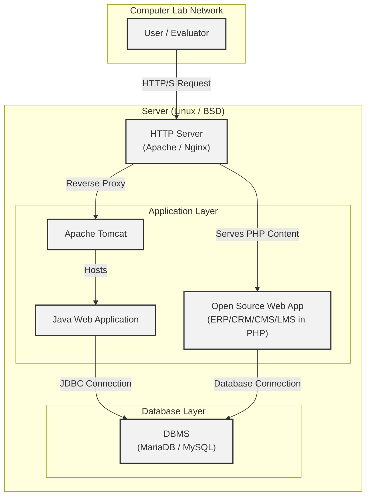
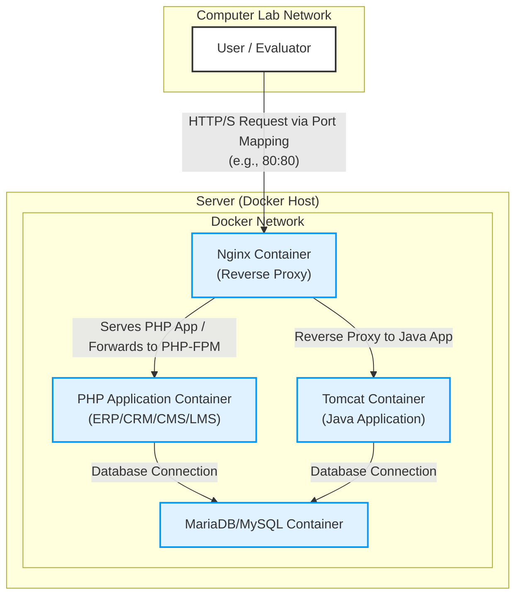
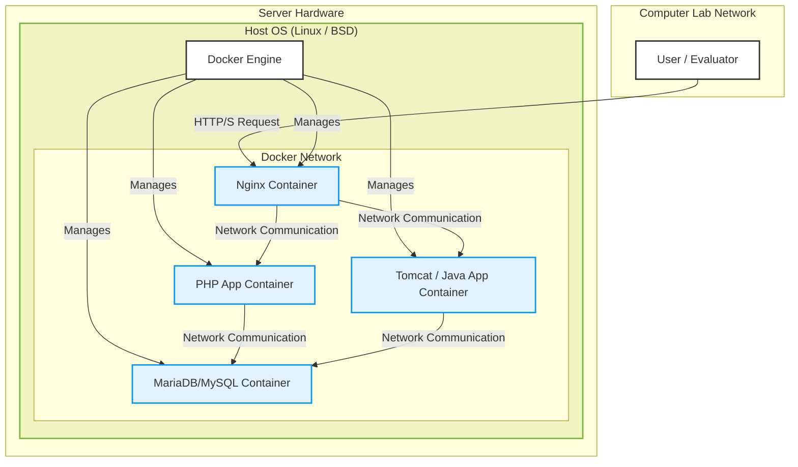
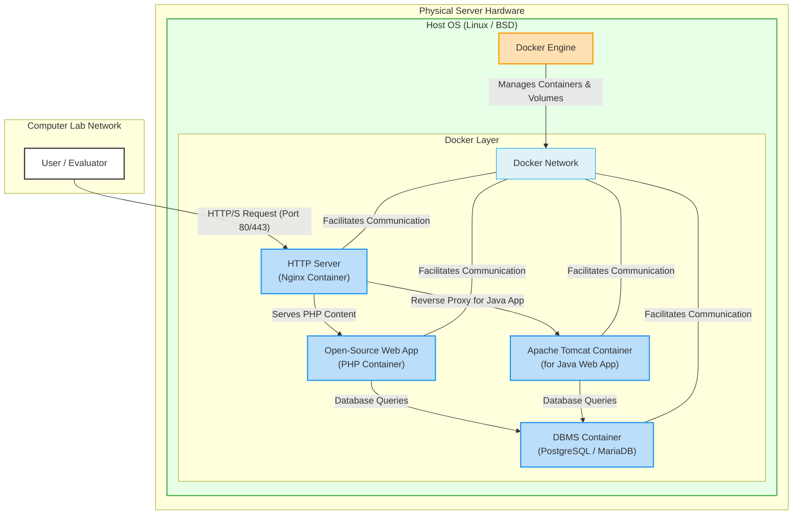
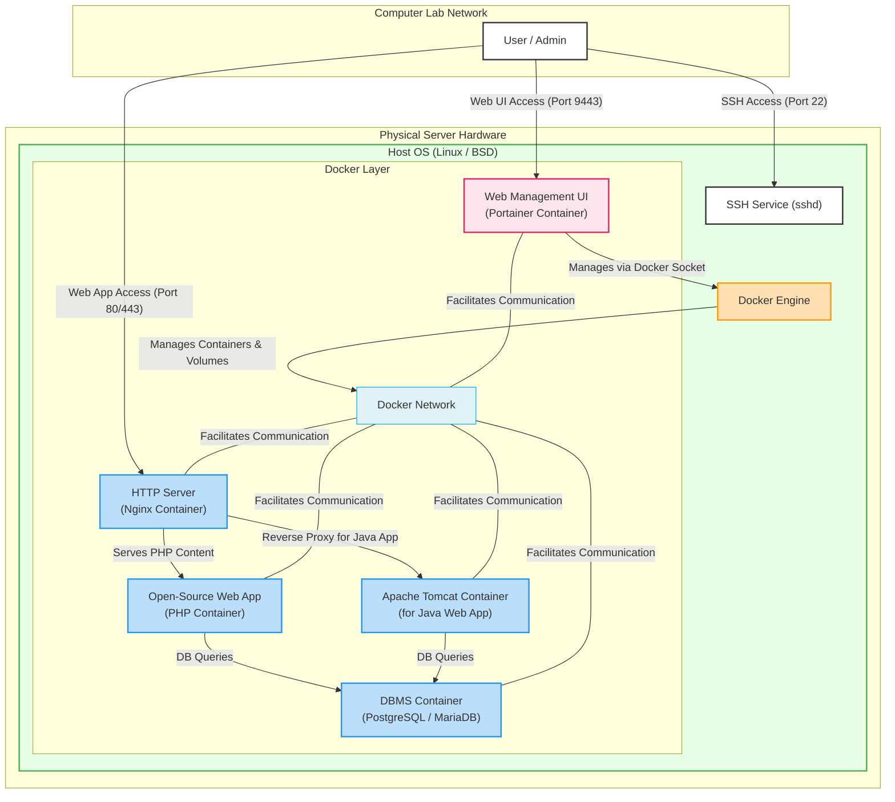
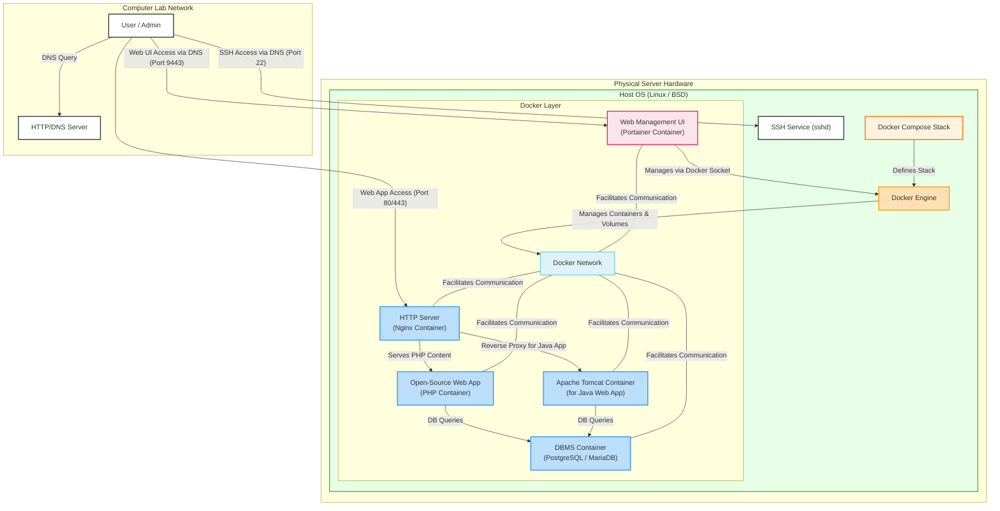
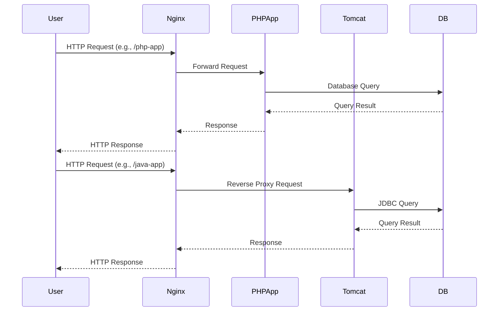
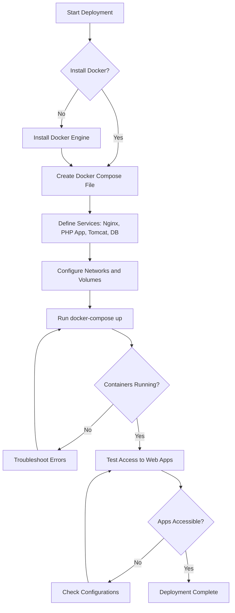
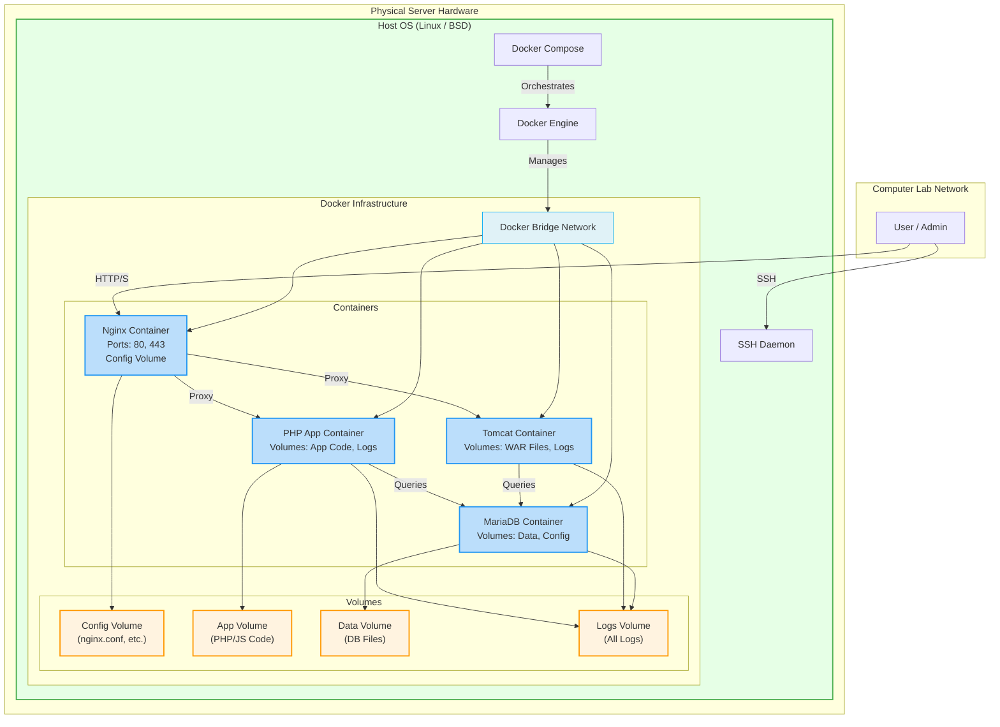

## Diagrama 01

```mermaid
graph TD
    subgraph "Computer Lab Network"
        User["User / Evaluator"]
    end

    subgraph "Server (Linux / BSD)"
        HTTPServer["HTTP Server
(Apache / Nginx)"]

        subgraph "Application Layer"
            Tomcat["Apache Tomcat"]
            WebApp["Open Source Web App
(ERP/CRM/CMS/LMS in PHP)"]
            JavaApp["Java Web Application"]
        end

        subgraph "Database Layer"
            DBMS["DBMS
(MariaDB / MySQL)"]
        end

    end

    %% Connections
    User -- "HTTP/S Request" --> HTTPServer
    HTTPServer -- "Serves PHP Content" --> WebApp
    HTTPServer -- "Reverse Proxy" --> Tomcat
    Tomcat -- "Hosts" --> JavaApp
    JavaApp -- "JDBC Connection" --> DBMS
    WebApp -- "Database Connection" --> DBMS

    %% Styling
    classDef default fill:#fff,stroke:#333,stroke-width:2px;
    classDef server fill:#f2f2f2,stroke:#333,stroke-width:2px,color:#333;
    class User,HTTPServer,Tomcat,WebApp,JavaApp,DBMS server;
```

## Diagrama 02

```mermaid
graph TD
    subgraph "Computer Lab Network"
        User["User / Evaluator"]
    end

    subgraph "Server (Docker Host)"
        subgraph "Docker Network"
            Nginx["Nginx Container
(Reverse Proxy)"]
            PHP_App["PHP Application Container
(ERP/CRM/CMS/LMS)"]
            Tomcat["Tomcat Container
(Java Application)"]
            Database["MariaDB/MySQL Container"]
        end
    end

    %% Connections
    User -- "HTTP/S Request via Port Mapping
(e.g., 80:80)" --> Nginx
    Nginx -- "Serves PHP App / Forwards to PHP-FPM" --> PHP_App
    Nginx -- "Reverse Proxy to Java App" --> Tomcat
    PHP_App -- "Database Connection" --> Database
    Tomcat -- "Database Connection" --> Database

    %% Styling
    classDef default fill:#fff,stroke:#333,stroke-width:2px;
    classDef container fill:#e0f2ff,stroke:#0b97f0,stroke-width:2px,color:#333;
    class Nginx,PHP_App,Tomcat,Database container;

```

## Diagrama 03

```mermaid
graph TD
    subgraph "Computer Lab Network"
        User["User / Evaluator"]
    end

    subgraph "Server Hardware"
        subgraph HostOS["Host OS (Linux / BSD)"]
            DockerEngine["Docker Engine"]

            subgraph "Docker Network"
                Nginx["Nginx Container"]
                PHP_App["PHP App Container"]
                Tomcat["Tomcat / Java App Container"]
                Database["MariaDB/MySQL Container"]
            end
        end
    end

    %% Connections
    User -- "HTTP/S Request" --> Nginx
    DockerEngine -- "Manages" --> Nginx
    DockerEngine -- "Manages" --> PHP_App
    DockerEngine -- "Manages" --> Tomcat
    DockerEngine -- "Manages" --> Database

    Nginx -- "Network Communication" --> PHP_App
    Nginx -- "Network Communication" --> Tomcat
    PHP_App -- "Network Communication" --> Database
    Tomcat -- "Network Communication" --> Database

    %% Styling
    classDef default fill:#fff,stroke:#333,stroke-width:2px;
    classDef host fill:#f0f4c3,stroke:#7cb342,stroke-width:2px;
    classDef container fill:#e0f2ff,stroke:#0b97f0,stroke-width:2px,color:#333;

    class HostOS host;
    class Nginx,PHP_App,Tomcat,Database container;
```

## Diagrama 04

```mermaid
graph TD
    subgraph "Computer Lab Network"
        User["User / Evaluator"]
    end

    subgraph "Physical Server Hardware"
        subgraph HostOS["Host OS (Linux / BSD)"]
            DockerEngine["Docker Engine"]

            subgraph "Docker Layer"
                direction LR
                DockerNetwork["Docker Network"]

                NginxContainer["HTTP Server
(Nginx Container)"]
                PHPAppContainer["Open-Source Web App
(PHP Container)"]
                TomcatContainer["Apache Tomcat Container
(for Java Web App)"]
                DBContainer["DBMS Container
(PostgreSQL / MariaDB)"]
            end
        end
    end

    %% Connections
    User -- "HTTP/S Request (Port 80/443)" --> NginxContainer
    NginxContainer -- "Serves PHP Content" --> PHPAppContainer
    NginxContainer -- "Reverse Proxy for Java App" --> TomcatContainer
    PHPAppContainer -- "Database Queries" --> DBContainer
    TomcatContainer -- "Database Queries" --> DBContainer

    %% Docker Management
    DockerEngine -- "Manages Containers & Volumes" --> DockerNetwork
    DockerNetwork -- "Facilitates Communication" --- NginxContainer
    DockerNetwork -- "Facilitates Communication" --- PHPAppContainer
    DockerNetwork -- "Facilitates Communication" --- TomcatContainer
    DockerNetwork -- "Facilitates Communication" --- DBContainer

    %% Styling
    classDef default fill:#fff,stroke:#333,stroke-width:2px;
    classDef hostOS fill:#e6ffe6,stroke:#4CAF50,stroke-width:2px,color:#333;
    classDef dockerEngine fill:#ffe0b2,stroke:#ff9800,stroke-width:2px,color:#333;
    classDef dockerContainer fill:#bbdefb,stroke:#2196F3,stroke-width:2px,color:#333;
    classDef dockerNetwork fill:#e0f2f7,stroke:#03A9F4,stroke-width:1px,color:#333;

    class HostOS hostOS;
    class DockerEngine dockerEngine;
    class NginxContainer,PHPAppContainer,TomcatContainer,DBContainer dockerContainer;
    class DockerNetwork dockerNetwork;
```

## Diagrama 05

```mermaid
graph TD
    subgraph "Computer Lab Network"
        User["User / Admin"]
    end

    subgraph "Physical Server Hardware"
        subgraph HostOS["Host OS (Linux / BSD)"]
            SSHDaemon["SSH Service (sshd)"]
            DockerEngine["Docker Engine"]

            subgraph "Docker Layer"
                direction LR
                DockerNetwork["Docker Network"]

                NginxContainer["HTTP Server
(Nginx Container)"]
                PHPAppContainer["Open-Source Web App
(PHP Container)"]
                TomcatContainer["Apache Tomcat Container
(for Java Web App)"]
                DBContainer["DBMS Container
(PostgreSQL / MariaDB)"]
                PortainerContainer["Web Management UI
(Portainer Container)"]
            end
        end
    end

    %% Application Connections
    User -- "Web App Access (Port 80/443)" --> NginxContainer
    NginxContainer -- "Serves PHP Content" --> PHPAppContainer
    NginxContainer -- "Reverse Proxy for Java App" --> TomcatContainer
    PHPAppContainer -- "DB Queries" --> DBContainer
    TomcatContainer -- "DB Queries" --> DBContainer

    %% Management Connections
    User -- "SSH Access (Port 22)" --> SSHDaemon
    User -- "Web UI Access (Port 9443)" --> PortainerContainer
    PortainerContainer -- "Manages via Docker Socket" --> DockerEngine

    %% Docker Internals
    DockerEngine -- "Manages Containers & Volumes" --> DockerNetwork
    DockerNetwork -- "Facilitates Communication" --- NginxContainer
    DockerNetwork -- "Facilitates Communication" --- PHPAppContainer
    DockerNetwork -- "Facilitates Communication" --- TomcatContainer
    DockerNetwork -- "Facilitates Communication" --- DBContainer
    DockerNetwork -- "Facilitates Communication" --- PortainerContainer

    %% Styling
    classDef default fill:#fff,stroke:#333,stroke-width:2px;
    classDef hostOS fill:#e6ffe6,stroke:#4CAF50,stroke-width:2px,color:#333;
    classDef dockerEngine fill:#ffe0b2,stroke:#ff9800,stroke-width:2px,color:#333;
    classDef dockerContainer fill:#bbdefb,stroke:#2196F3,stroke-width:2px,color:#333;
    classDef management fill:#fce4ec,stroke:#e91e63,stroke-width:2px,color:#333;
    classDef dockerNetwork fill:#e0f2f7,stroke:#03A9F4,stroke-width:1px,color:#333;

    class HostOS hostOS;
    class DockerEngine dockerEngine;
    class NginxContainer,PHPAppContainer,TomcatContainer,DBContainer dockerContainer;
    class PortainerContainer management;
    class DockerNetwork dockerNetwork;
```

## Diagrama 06

```mermaid
graph TD
    subgraph "Computer Lab Network"
        User["User / Admin"]
        HTTPServer["HTTP/DNS Server"]
    end

    subgraph "Physical Server Hardware"
        subgraph HostOS["Host OS (Linux / BSD)"]
            SSHDaemon["SSH Service (sshd)"]
            DockerEngine["Docker Engine"]
            DockerCompose["Docker Compose Stack"]

            subgraph "Docker Layer"
                direction LR
                DockerNetwork["Docker Network"]

                NginxContainer["HTTP Server
(Nginx Container)"]
                PHPAppContainer["Open-Source Web App
(PHP Container)"]
                TomcatContainer["Apache Tomcat Container
(for Java Web App)"]
                DBContainer["DBMS Container
(PostgreSQL / MariaDB)"]
                PortainerContainer["Web Management UI
(Portainer Container)"]
            end
        end
    end

    %% Application Connections
    User -- "Web App Access (Port 80/443)" --> NginxContainer
    NginxContainer -- "Serves PHP Content" --> PHPAppContainer
    NginxContainer -- "Reverse Proxy for Java App" --> TomcatContainer
    PHPAppContainer -- "DB Queries" --> DBContainer
    TomcatContainer -- "DB Queries" --> DBContainer

    %% Management Connections
    User -- "DNS Query" --> HTTPServer
    User -- "SSH Access via DNS (Port 22)" --> SSHDaemon
    User -- "Web UI Access via DNS (Port 9443)" --> PortainerContainer
    PortainerContainer -- "Manages via Docker Socket" --> DockerEngine
    DockerCompose -- "Defines Stack" --> DockerEngine

    %% Docker Internals
    DockerEngine -- "Manages Containers & Volumes" --> DockerNetwork
    DockerNetwork -- "Facilitates Communication" --- NginxContainer
    DockerNetwork -- "Facilitates Communication" --- PHPAppContainer
    DockerNetwork -- "Facilitates Communication" --- TomcatContainer
    DockerNetwork -- "Facilitates Communication" --- DBContainer
    DockerNetwork -- "Facilitates Communication" --- PortainerContainer

    %% Styling
    classDef default fill:#fff,stroke:#333,stroke-width:2px;
    classDef hostOS fill:#e6ffe6,stroke:#4CAF50,stroke-width:2px,color:#333;
    classDef dockerEngine fill:#ffe0b2,stroke:#ff9800,stroke-width:2px,color:#333;
    classDef dockerContainer fill:#bbdefb,stroke:#2196F3,stroke-width:2px,color:#333;
    classDef management fill:#fce4ec,stroke:#e91e63,stroke-width:2px,color:#333;
    classDef dockerNetwork fill:#e0f2f7,stroke:#03A9F4,stroke-width:1px,color:#333;
    classDef compose fill:#fff3e0,stroke:#ff6f00,stroke-width:2px,color:#333;

    class HostOS hostOS;
    class DockerEngine dockerEngine;
    class DockerCompose compose;
    class NginxContainer,PHPAppContainer,TomcatContainer,DBContainer dockerContainer;
    class PortainerContainer management;
    class DockerNetwork dockerNetwork;
```

## Diagrama 07

```mermaid
sequenceDiagram
    participant User
    participant Nginx
    participant PHPApp
    participant Tomcat
    participant DB

    User->>Nginx: HTTP Request (e.g., /php-app)
    Nginx->>PHPApp: Forward Request
    PHPApp->>DB: Database Query
    DB-->>PHPApp: Query Result
    PHPApp-->>Nginx: Response
    Nginx-->>User: HTTP Response

    User->>Nginx: HTTP Request (e.g., /java-app)
    Nginx->>Tomcat: Reverse Proxy Request
    Tomcat->>DB: JDBC Query
    DB-->>Tomcat: Query Result
    Tomcat-->>Nginx: Response
    Nginx-->>User: HTTP Response
```

## Diagrama 08

```mermaid
flowchart TD
    A[Start Deployment] --> B{Install Docker?}
    B -->|No| C[Install Docker Engine]
    B -->|Yes| D[Create Docker Compose File]
    C --> D
    D --> E[Define Services: Nginx, PHP App, Tomcat, DB]
    E --> F[Configure Networks and Volumes]
    F --> G[Run docker-compose up]
    G --> H{Containers Running?}
    H -->|No| I[Troubleshoot Errors]
    I --> G
    H -->|Yes| J[Test Access to Web Apps]
    J --> K{Apps Accessible?}
    K -->|No| L[Check Configurations]
    L --> J
    K -->|Yes| M[Deployment Complete]
```

## Diagrama 09

```mermaid
graph TD
    subgraph "Computer Lab Network"
        User["User / Admin"]
    end

    subgraph "Physical Server Hardware"
        subgraph HostOS["Host OS (Linux / BSD)"]
            SSH["SSH Daemon"]
            DockerEngine["Docker Engine"]
            DockerCompose["Docker Compose"]

            subgraph "Docker Infrastructure"
                DockerNetwork["Docker Bridge Network"]

                subgraph "Containers"
                    NginxC["Nginx Container<br/>Ports: 80, 443<br/>Config Volume"]
                    PHPC["PHP App Container<br/>Volumes: App Code, Logs"]
                    TomcatC["Tomcat Container<br/>Volumes: WAR Files, Logs"]
                    DBC["MariaDB Container<br/>Volumes: Data, Config"]
                end

                subgraph "Volumes"
                    ConfigVol["Config Volume<br/>(nginx.conf, etc.)"]
                    AppVol["App Volume<br/>(PHP/JS Code)"]
                    DataVol["Data Volume<br/>(DB Files)"]
                    LogsVol["Logs Volume<br/>(All Logs)"]
                end
            end
        end
    end

    %% Connections
    User -->|HTTP/S| NginxC
    User -->|SSH| SSH
    NginxC -->|Proxy| PHPC
    NginxC -->|Proxy| TomcatC
    PHPC -->|Queries| DBC
    TomcatC -->|Queries| DBC

    %% Volume Mounts
    NginxC --> ConfigVol
    PHPC --> AppVol
    PHPC --> LogsVol
    TomcatC --> LogsVol
    DBC --> DataVol
    DBC --> LogsVol

    %% Docker Management
    DockerCompose -->|Orchestrates| DockerEngine
    DockerEngine -->|Manages| DockerNetwork
    DockerNetwork --> NginxC
    DockerNetwork --> PHPC
    DockerNetwork --> TomcatC
    DockerNetwork --> DBC

    %% Styling
    classDef host fill:#e6ffe6,stroke:#4CAF50,stroke-width:2px;
    classDef container fill:#bbdefb,stroke:#2196F3,stroke-width:2px;
    classDef volume fill:#fff3e0,stroke:#ff9800,stroke-width:2px;
    classDef network fill:#e0f2f7,stroke:#03A9F4,stroke-width:1px;

    class HostOS host;
    class NginxC,PHPC,TomcatC,DBC container;
    class ConfigVol,AppVol,DataVol,LogsVol volume;
    class DockerNetwork network;
```
