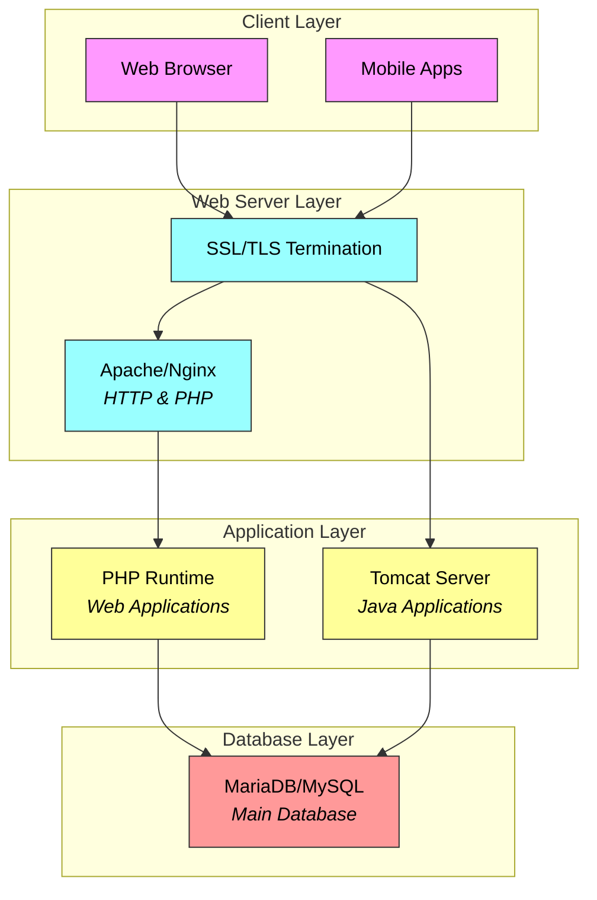
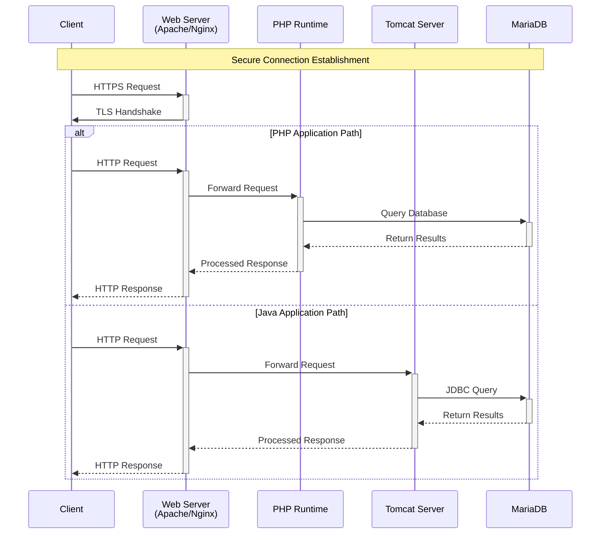
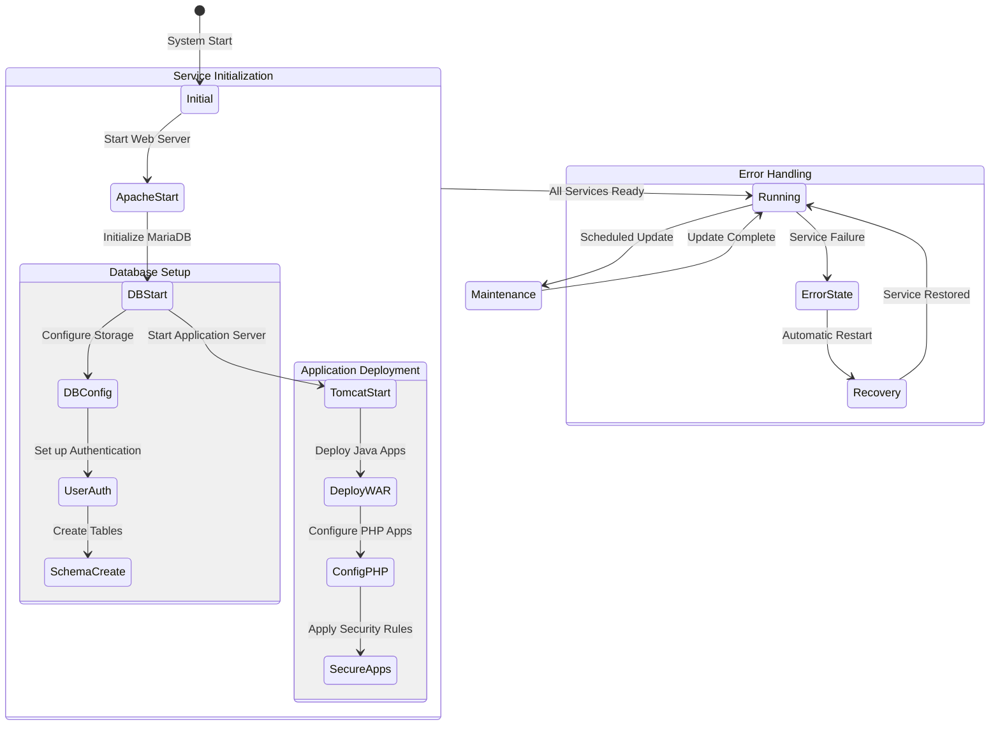
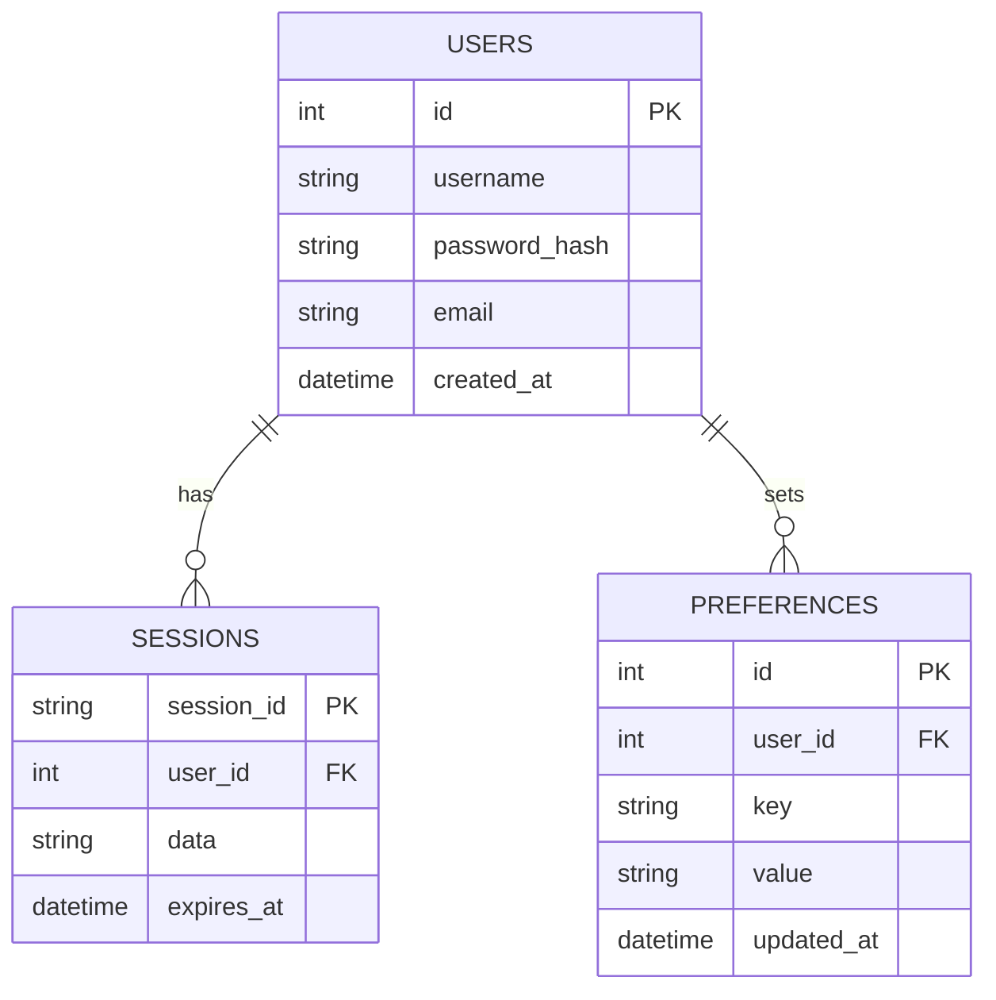
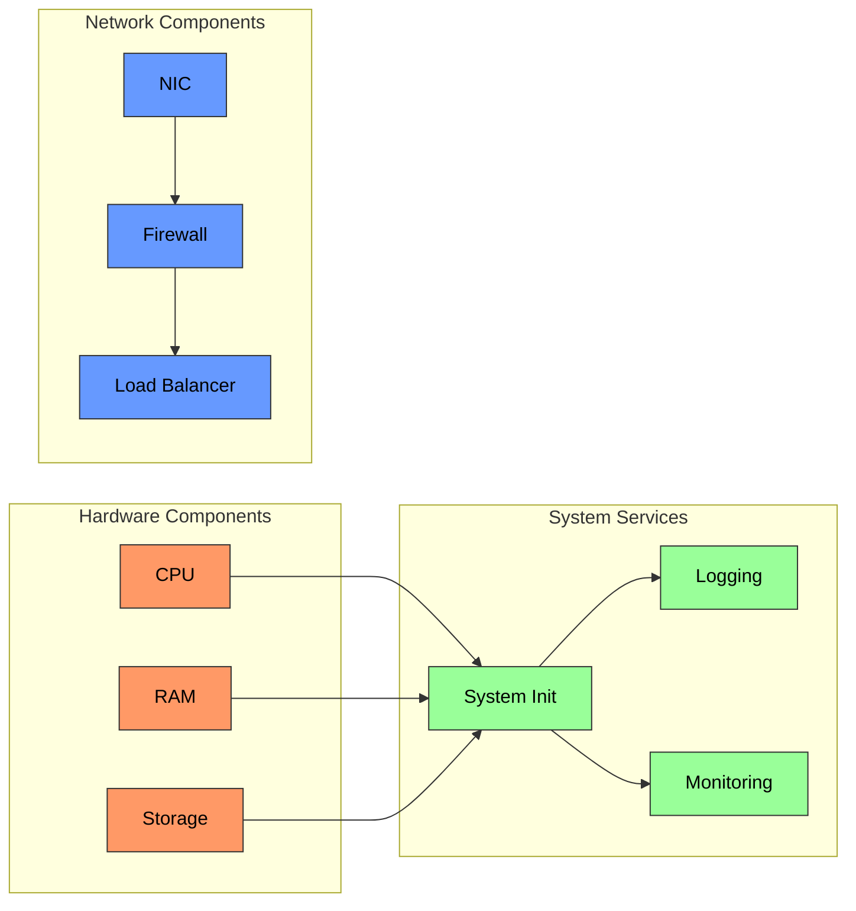

Let me help you create comprehensive diagrams for your server infrastructure project. I'll start with a high-level architectural overview showing how all components interact.

The diagram above illustrates the complete system architecture, where:

- Pink components represent client-side applications
- Blue components show web server layer handling initial requests
- Yellow represents application servers processing business logic
- Red indicates the database storage layer

All traffic flows through SSL/TLS termination for secure communication, and both web applications (PHP) and Java applications (via Tomcat) share the same database backend.

Now let's look at the detailed component interactions with a sequence diagram:

This sequence diagram illustrates two main request flows:

1. PHP Application Path: Handles requests for PHP-based applications (like CMS/LMS systems)
2. Java Application Path: Manages requests for Java-based applications running on Tomcat

Both paths start with secure TLS handshake for encryption, ensuring all communications are protected. The database queries differ slightly - PHP uses direct SQL queries while Java applications use JDBC (Java Database Connectivity) for better integration with Tomcat.

Now let's examine the system state transitions during operation:

The state diagram shows the system lifecycle, where:

- WAR (Web ARchive) deployment refers to packaging and deploying Java web applications
- Security rules include firewall configurations, access controls, and encryption settings
- Maintenance and error states operate independently - scheduled updates happen regularly while automatic recovery handles unexpected failures

Now let's visualize the database structure with an ERD:

The Entity Relationship Diagram (ERD) shows the core database tables and their relationships:

- The notation ||--o{ indicates "one-to-many" relationships (e.g., one user can have many sessions)
- Password_hash stores encrypted passwords rather than plain text for security
- Session expiration ensures automatic logout after inactivity
- Preferences table allows storing user-specific settings without modifying core tables

Finally, let's visualize the physical deployment architecture:

This deployment diagram illustrates the physical architecture where:

- Orange components represent hardware resources managed by the system
- Blue components show network infrastructure ensuring secure communication
- Green components indicate essential system services

While this setup uses a single server, the load balancer configuration prepares the system for potential future scaling. System Init manages service startup order, while separate logging and monitoring services ensure reliable operation tracking and performance oversight.

These diagrams together provide a complete picture of your server infrastructure project, from high-level architecture to detailed implementation considerations. Each diagram focuses on different aspects of the system design, helping you understand both the overall structure and specific technical details required for successful implementation.
