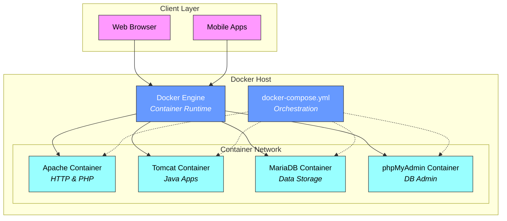
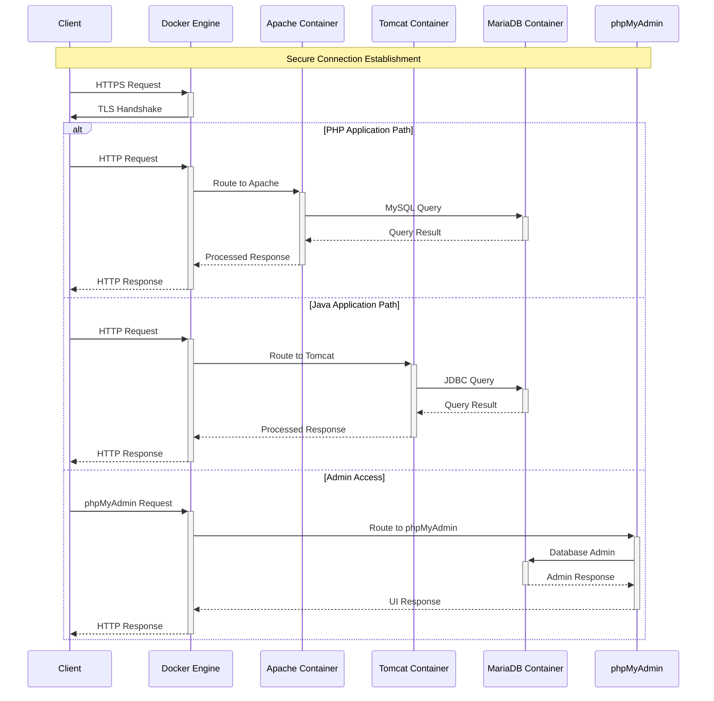
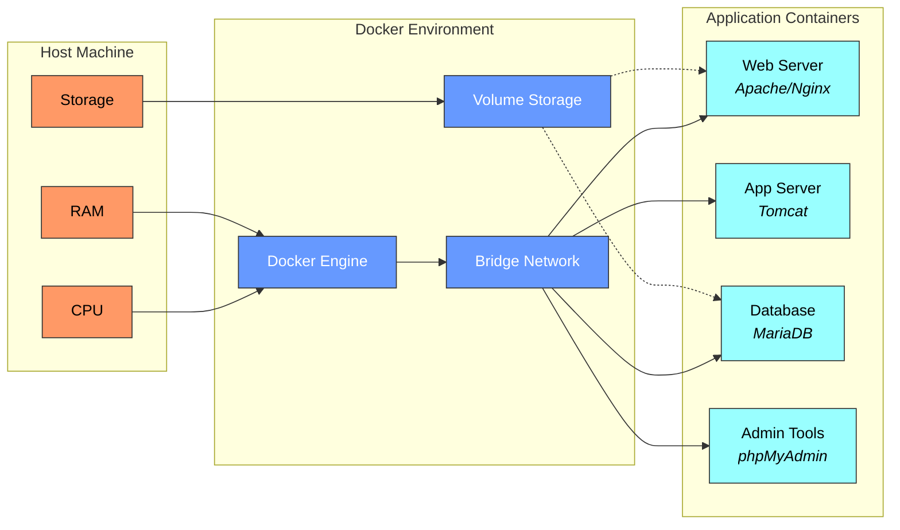

Let me update the diagrams to reflect a containerized architecture using Docker and Docker Compose.

First, let's look at the high-level container architecture:



In this containerized architecture:

- Purple components represent client applications
- Blue components show Docker infrastructure managing containers
- Light blue components represent individual containers running specific services
- Dotted lines indicate Docker Compose's orchestration control over containers

All containers communicate through Docker's internal network, while Docker Engine manages their lifecycle and resources. Docker Compose orchestrates the entire stack through a single configuration file.

Let's examine how these containers interact with each other:



This sequence diagram illustrates three main request flows through the containerized system:

1. PHP Application Path: Handles PHP-based applications running in Apache container
2. Java Application Path: Manages Java applications running in Tomcat container
3. Admin Access: Provides secure database administration through phpMyAdmin

Docker Engine acts as a central router, directing traffic to appropriate containers while maintaining security through TLS encryption. Each container operates independently but communicates securely through Docker's internal network.

Let's examine the system lifecycle in a containerized environment:

```mermaid
stateDiagram-v2
    [*] --> Init: docker-compose up
    
    state "Container Initialization" as Init {
        Init --> PullImages: Pull Docker Images
        PullImages --> CreateNetwork: Create Network
        CreateNetwork --> StartDB: Start MariaDB
        
        state "Database Setup" as DBSetup {
            StartDB --> DBReady: Wait for DB Ready
            DBReady --> InitSchema: Initialize Schema
            InitSchema --> DBConfigured: Configure Users
        }
        
        state "Web Services" as WebServices {
            StartDB --> StartApache: Start Apache
            StartApache --> ConfigPHP: Configure PHP-FPM
            ConfigPHP --> StartTomcat: Start Tomcat
            StartTomcat --> DeployApps: Deploy Applications
        }
        
        DBSetup --> WebServices
    }
    
    Init --> Running: All Containers Up
    Running --> Maintenance: docker-compose exec
    Maintenance --> Running: Updates Applied
    
    state "Error Handling" as Error {
        Running --> ContainerError: Container Failure
        ContainerError --> Recovery: docker-compose restart
        Recovery --> Running: Container Restored
    }
```

The state diagram shows the container lifecycle where:

- Image pulling creates local copies of container templates
- Network creation enables secure communication between containers
- DB Ready state waits for MariaDB to accept connections before proceeding
- PHP-FPM (FastCGI Process Manager) handles PHP processing separately from Apache for better performance

Error handling automatically restarts failed containers while maintaining data consistency through persistent volumes.

Finally, let's look at the physical deployment architecture:



This deployment diagram shows the complete container infrastructure where:

- Orange components represent host machine resources
- Blue components indicate Docker infrastructure
- Light blue components show individual application containers
- Dotted lines to Volumes indicate persistent storage mounts for data preservation

The Bridge Network enables secure communication between containers, while Volume Storage maintains data persistence across container restarts. Each container runs isolated processes but shares necessary resources through controlled interfaces.

These diagrams together provide a complete picture of your containerized server infrastructure project. They show how Docker and Docker Compose simplify deployment while maintaining the robust architecture of the previous design. Each component now runs in isolation, improving security and maintainability while preserving all required functionality.
