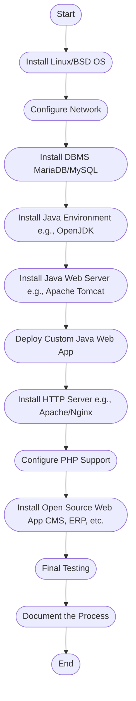
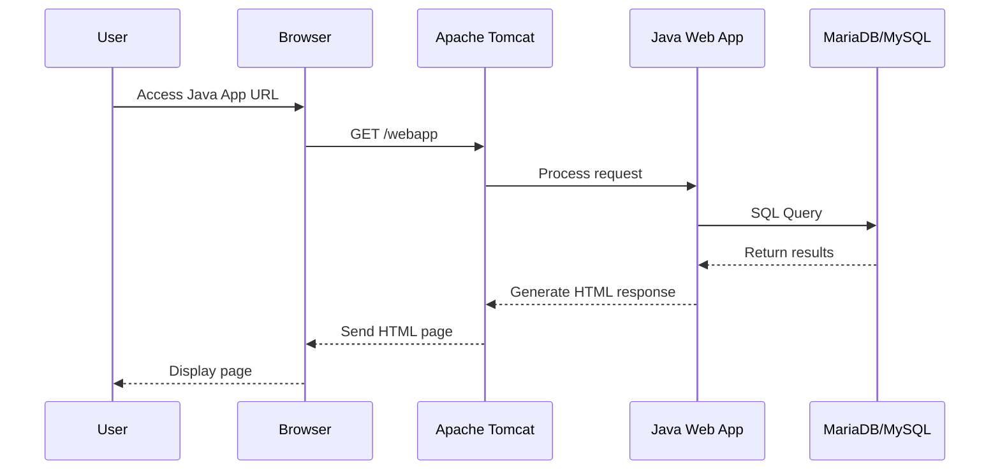
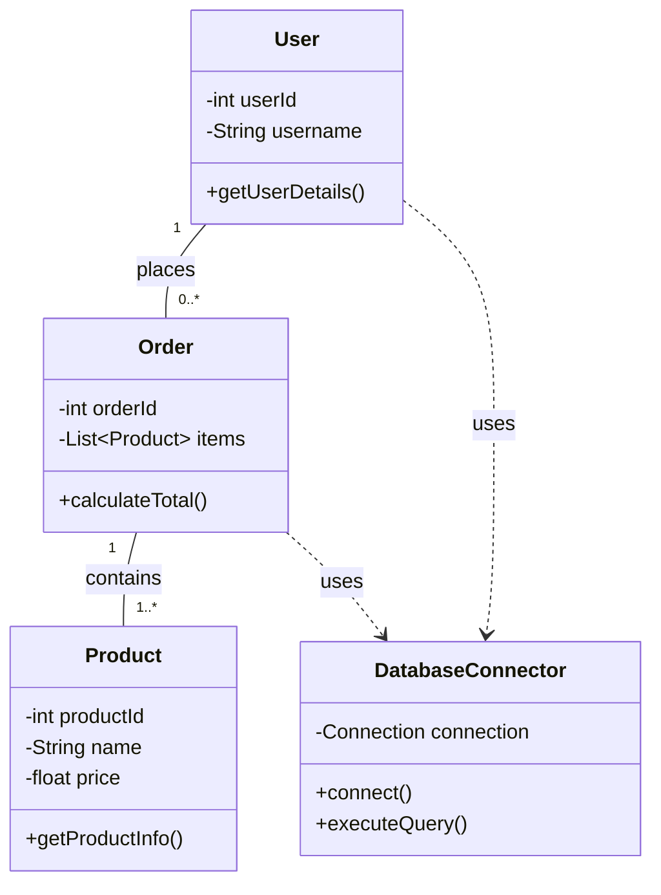
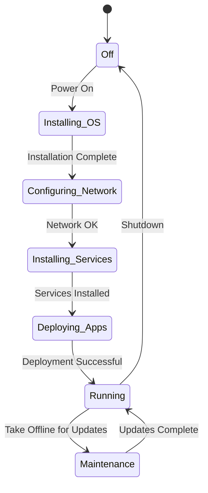
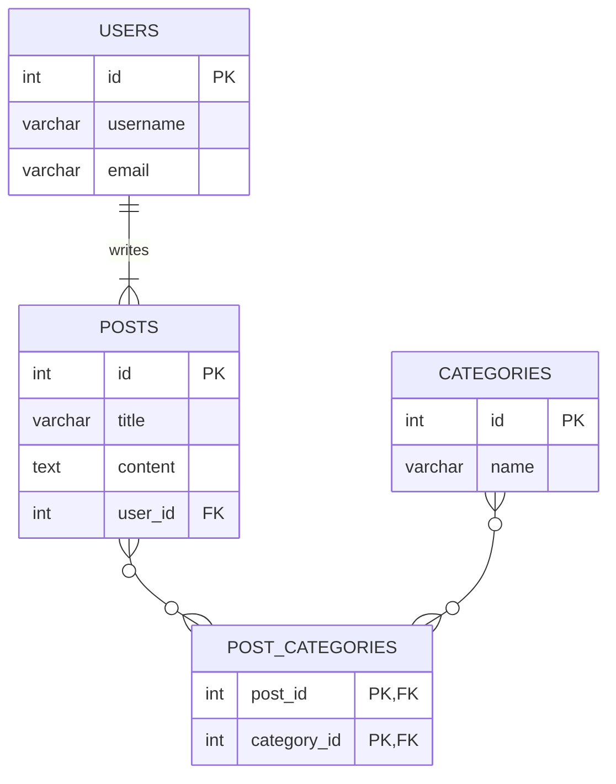
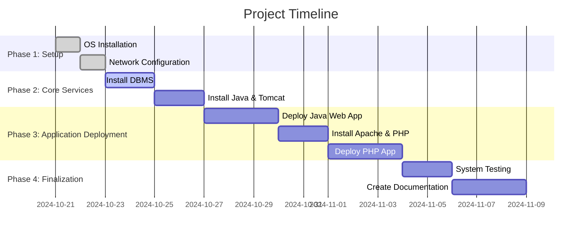
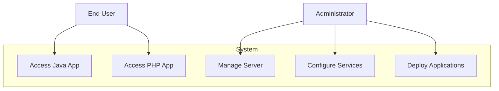
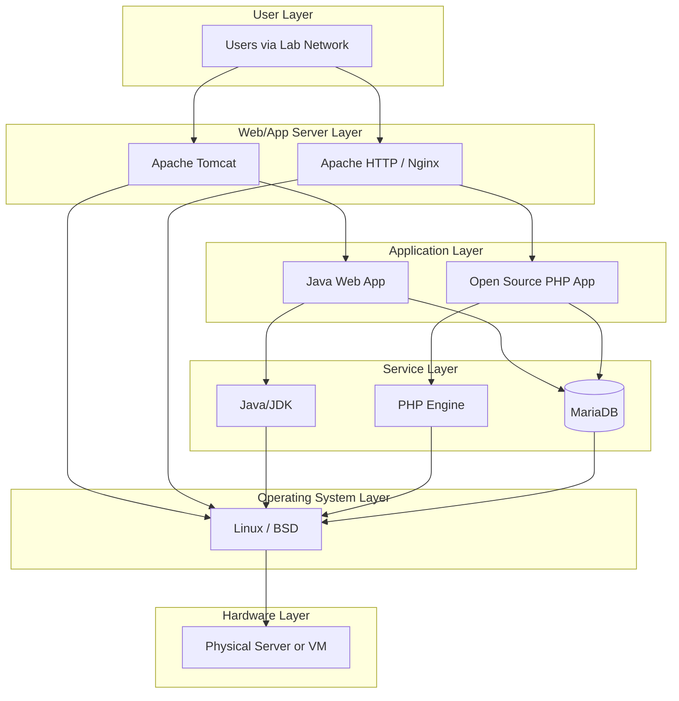

# Project Guidelines: Visualized

This document provides various diagrams to visualize the workflow, architecture, and management of the server installation and configuration project.

---

## 1. Project Workflow (Flowchart)

This flowchart illustrates the high-level, step-by-step process for completing the project from start to finish.

---

## 2. System Interaction (Sequence Diagram)

This diagram shows how different components of the system interact when a user accesses the Java web application.

---

## 3. Java Application (Simplified Class Diagram)

This is a simplified example of a class structure for the Java web application that interacts with the database.

---

## 4. Server Setup (State Diagram)

This diagram represents the various states of the server throughout the installation and configuration process.

---

## 5. Database Schema (ERD)

An example Entity-Relationship Diagram for a simple Content Management System (CMS) that could be hosted on the server.

---

## 6. Project Timeline (Gantt Chart)

This Gantt chart provides a sample timeline to help plan and manage the project tasks.

---

## 7. System Usage (UML Use Case Diagram)

This diagram shows the different ways users and administrators can interact with the fully configured server.

---

## 8. Server Architecture Diagram

This diagram outlines the high-level architecture of the server, showing how the different software layers are stacked.

