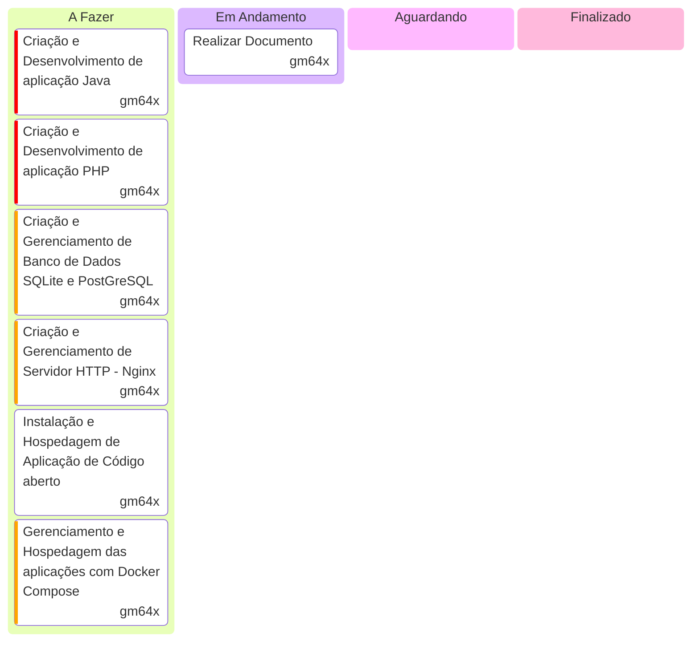

# Kanban

```mermaid
kanban
  todo[A Fazer]
    dev[Criação e Desenvolvimento de aplicação Java]@{ assigned: 'gm64x', priority: 'Very High' }
    dev[Criação e Desenvolvimento de aplicação PHP]@{ assigned: 'gm64x', priority: 'Very High' }
    dev[Criação e Gerenciamento de Banco de Dados SQLite e PostGreSQL]@{ assigned: 'gm64x', priority: 'High' }
    ci-ops[Criação e Gerenciamento de Servidor HTTP - Nginx]@{ assigned: 'gm64x', priority: 'High' }
    ci-ops[Instalação e Hospedagem de Aplicação de Código aberto]@{ assigned: 'gm64x', priority: 'Medium' }
    ci-ops[Gerenciamento e Hospedagem das aplicações com Docker Compose]@{ assigned: 'gm64x', priority: 'High' }

    

  column2[Em Andamento]
    doc[Realizar Documento]@{ assigned: 'gm64x', priority: 'Medium' }


  column3[Aguardando]

  column4[Finalizado]

```
